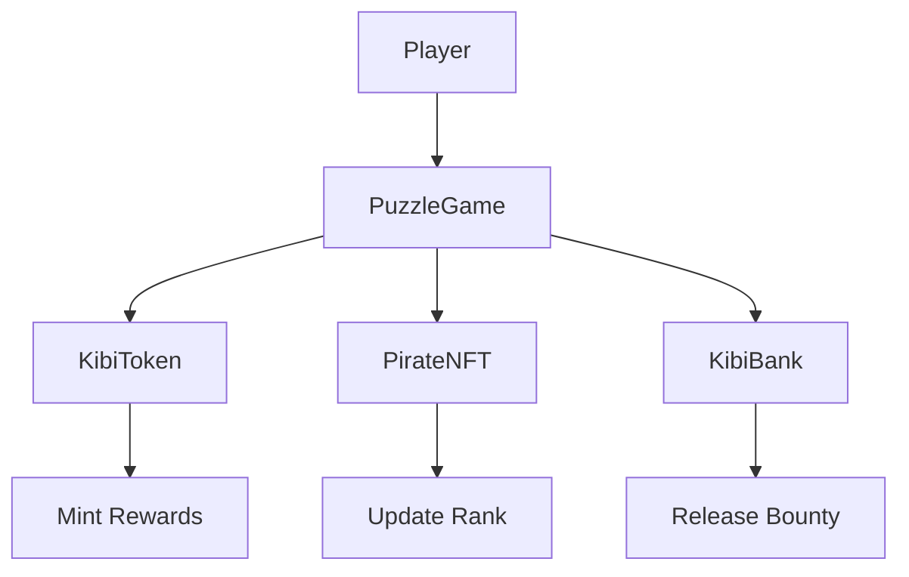

# 🍡 Kibi Dango - Web3 Puzzle Game

A full-stack decentralized puzzle game built on Starknet, where players solve cryptographic puzzles to earn $KIBI tokens and level up their pirate NFTs. Features AI-generated daily puzzles, user-created challenges, and a dynamic NFT progression system.


## 🎮 Game Overview

Kibi Dango is a One Piece-inspired puzzle game where players:

- **Solve Daily Puzzles** - AI-generated challenges with automatic rewards
- **Create & Solve Community Puzzles** - User-generated content with bounties
- **Earn $KIBI Tokens** - ERC-20 rewards for puzzle solving
- **Level Up Pirate NFTs** - Dynamic progression based on achievements
- **Compete on Leaderboards** - Track performance and rankings

## 🏗️ Architecture

```
kibi-dango/
├── packages/
│   ├── snfoundry/          # Smart Contracts (Cairo)
│   │   ├── contracts/      # Core game contracts
│   │   ├── scripts-ts/     # Deployment scripts
│   │   └── deployments/    # Contract addresses
│   └── nextjs/            # Frontend Application
│       ├── app/           # Next.js 15 App Router
│       ├── components/    # React components
│       ├── lib/          # Utilities & API
│       └── services/     # Web3 services
└── pirate-nft-metadata/  # NFT metadata & assets
```

## 🎯 Core Features

### 🧩 Puzzle System
- **AI-Generated Daily Puzzles** - Unique challenges every day using Google Gemini
- **User-Created Puzzles** - Community-driven content with custom bounties
- **Cryptographic Verification** - Hash commitments prevent front-running
- **Difficulty Levels** - Easy, Medium, Hard with different reward tiers

### 🏴‍☠️ Pirate NFT Progression
- **Dynamic Ranks** - 8 progression levels from TamedBeast to LeadPerformer
- **Automatic Upgrades** - NFT evolves based on puzzles solved
- **SRC5 Metadata** - Dynamic token URIs reflecting current rank
- **Achievement Tracking** - Visual progression through pirate ranks

### 💰 Token Economics
- **$KIBI ERC-20** - Game reward token with controlled minting
- **Bounty System** - User-created puzzles with custom rewards
- **Rank Multipliers** - Higher-ranked players earn more from AI puzzles
- **Escrow System** - Secure bounty management through KibiBank

## 🛠️ Tech Stack

### Smart Contracts
- **Cairo 2.11.4** - Starknet's native language
- **OpenZeppelin Cairo** - Battle-tested contract components
- **Starknet Foundry** - Testing and deployment framework
- **Upgradeable Contracts** - Future-proof architecture

### Frontend
- **Next.js 15** - React framework with App Router
- **TypeScript** - Type-safe development
- **Starknet.js** - Web3 library for Starknet
- **TailwindCSS** - Utility-first CSS framework
- **Radix UI** - Accessible component primitives

### Backend & Data
- **MongoDB** - Off-chain puzzle and user data
- **Mongoose** - MongoDB ODM for Node.js
- **API Routes** - Next.js serverless functions
- **Google Gemini AI** - Puzzle generation

### Development Tools
- **Scarb** - Cairo package manager
- **Vitest** - Unit testing framework
- **ESLint & Prettier** - Code quality tools
- **Vercel** - Deployment platform

## 🚀 Quick Start

### Prerequisites

- [Node.js](https://nodejs.org/) (v18+)
- [Scarb](https://docs.swmansion.com/scarb/) (Cairo package manager)
- [Argent X](https://www.argent.xyz/) or [Braavos](https://braavos.app/) wallet
- [MongoDB](https://www.mongodb.com/) database
- [Google Gemini API](https://ai.google.dev/) key

### Installation

```bash
# Clone the repository
git clone https://github.com/truthixify/kibi-dango
cd kibi-dango

# Install dependencies
yarn install

# Build smart contracts
cd packages/snfoundry/contracts
scarb build

# Set up environment variables
cd ../../nextjs
cp .env.example .env
```

### Environment Configuration

Create `.env` file in `packages/nextjs/`:

```env
# Database
MONGO_URI=mongodb://localhost:27017/kibidango

# AI Services
GEMINI_API_KEY=your_gemini_api_key
PROMPT=your_puzzle_generation_prompt

# Starknet
NEXT_PUBLIC_STARKNET_NETWORK=sepolia
NEXT_PUBLIC_CONTRACT_ADDRESSES={"PuzzleGame":"0x...","KibiToken":"0x...","PirateNFT":"0x...","KibiBank":"0x..."}

# Optional: Analytics & Monitoring
NEXT_PUBLIC_VERCEL_ANALYTICS_ID=your_analytics_id
```

### Development

```bash
# Start frontend development server
cd packages/nextjs
yarn dev

# Run smart contract tests
cd ../snfoundry/contracts
scarb test

# Deploy contracts (configure first)
cd ../scripts-ts
npm run deploy
```

## 📱 Application Features

### 🏠 Home Page
- **Daily Puzzle Challenge** - AI-generated puzzle with automatic rewards
- **Quick Stats** - Player's rank, tokens earned, puzzles solved
- **Recent Activity** - Latest puzzle completions and achievements

### 🧩 Puzzle Marketplace
- **Solve Challenges** - Submit solutions with cryptographic verification
- **Create Puzzles** - Design and publish custom challenges with bounties

### 👤 Player Dashboard
- **Pirate Profile** - NFT display with current rank and stats
- **Achievement History** - Track puzzle-solving progress
- **Token Balance** - $KIBI earnings and transaction history

### 🏆 Leaderboard
- **Global Rankings** - Top players by puzzles solved and tokens earned
- **Rank Categories** - Leaderboards for each pirate rank
- **Achievement Tracking** - Milestone celebrations and rewards

### ⚙️ Game Configuration
- **Contract Management** - Admin tools for game parameters
- **Puzzle Generation** - AI prompt configuration and testing
- **Reward Settings** - Bounty minimums and difficulty multipliers

## 🔧 Smart Contracts

### Core Contracts

#### KibiToken (ERC-20)
```cairo
// Standard ERC-20 with controlled minting
- transfer(), approve(), allowance() - Standard token functions
- mint() - Only callable by PuzzleGame contract
- upgrade() - Upgradeable contract architecture
```

#### PirateNFT (ERC-721)
```cairo
// Dynamic NFT with rank progression
- mint_if_needed() - Automatic NFT creation for new players
- increment_solved_count() - Update stats and rank
- get_rank() - Return current pirate rank
- tokenURI() - Dynamic metadata based on rank
```

#### PuzzleGame (Main Logic)
```cairo
// Core game mechanics
- create_puzzle() - Submit puzzle with hash commitment
- submit_solution() - Verify solution and distribute rewards
- get_puzzle() - Retrieve puzzle data
- upgrade() - Contract upgradeability
```

#### KibiBank (Escrow)
```cairo
// Secure bounty management
- deposit_for_puzzle() - Lock tokens for puzzle bounty
- release_bounty() - Transfer bounty to solver
- get_deposit_info() - Query deposit status
```

### Contract Interactions



## 🌐 API Endpoints

### Puzzle Management
```typescript
// Daily Puzzles
POST /api/daily-puzzle - Create AI-generated daily puzzle
GET /api/daily-puzzle?address={address} - Get user's daily puzzle
PUT /api/daily-puzzle - Mark puzzle as solved

// Community Puzzles
GET /api/puzzles - List all available puzzles
POST /api/puzzles - Create new user puzzle
PUT /api/puzzles - Update puzzle status
GET /api/puzzles/[puzzleId] - Get specific puzzle details
```

### User Management
```typescript
// User Profiles
GET /api/user/[address] - Get user profile and stats
POST /api/user - Register new user
PUT /api/user/[address] - Update user information
```

### AI Integration
```typescript
// Puzzle Generation
POST /api/daily-puzzle/generate - Generate AI puzzle
GET /api/daily-puzzle/generate - Test puzzle generation
```

## 🎨 UI Components

### Core Components
- **WalletConnect** - Starknet wallet integration
- **PuzzleCard** - Display puzzle information and solve interface
- **PirateProfile** - NFT display with rank progression
- **Leaderboard** - Player rankings and achievements
- **PuzzleForm** - Create and submit puzzles

### Design System
- **Minimal Design** - Clean, modern interface
- **Responsive Layout** - Mobile-first approach
- **Dark/Light Themes** - Theme switching support
- **Loading States** - Smooth user experience
- **Success/Error Feedback** - Clear transaction status

## 🔐 Security Features

### Smart Contract Security
- **Access Control** - Only authorized contracts can perform critical operations
- **Hash Commitments** - Prevent front-running and solution theft
- **Minimum Bounties** - Prevent spam and low-quality puzzles
- **Upgradeable Contracts** - Security patches and improvements

### Frontend Security
- **Input Validation** - Client-side and server-side validation
- **Rate Limiting** - Prevent API abuse
- **Error Handling** - Graceful failure handling
- **Transaction Confirmation** - Clear feedback for all operations

## 🧪 Testing

### Smart Contract Testing
```bash
# Run all tests
cd packages/snfoundry/contracts
scarb test

# Run specific test file
snforge test --path tests/test_contract.cairo

# Run with coverage
snforge test --coverage
```

### Frontend Testing
```bash
# Run unit tests
cd packages/nextjs
yarn test

# Run with coverage
yarn coverage

# Run E2E tests (if configured)
yarn test:e2e
```

## 📦 Deployment

### Smart Contracts
```bash
# Deploy to Sepolia testnet
cd packages/snfoundry/scripts-ts
npm run deploy:sepolia

# Deploy to mainnet
npm run deploy:mainnet

# Verify contracts
npm run verify -- --contract PuzzleGame --address 0x...
```

### Frontend
```bash
# Deploy to Vercel
cd packages/nextjs
vercel --prod

# Or build and deploy manually
yarn build
yarn start
```

### Environment Setup
1. **Configure Environment Variables** - Set up all required API keys and contract addresses
2. **Deploy Smart Contracts** - Deploy in order: KibiToken → PirateNFT → KibiBank → PuzzleGame
3. **Update Contract Addresses** - Update frontend configuration with deployed addresses
4. **Set Up Database** - Configure MongoDB connection and indexes
5. **Configure AI Services** - Set up Google Gemini API for puzzle generation

## 🤝 Contributing

### Development Workflow
1. **Fork Repository** - Create your own fork
2. **Create Feature Branch** - `git checkout -b feature/amazing-feature`
3. **Make Changes** - Implement your feature or fix
4. **Add Tests** - Ensure all functionality is tested
5. **Run Linting** - `yarn lint` and `yarn format`
6. **Submit Pull Request** - Create PR with detailed description

### Code Standards
- **TypeScript** - Strict type checking enabled
- **ESLint** - Follow linting rules
- **Prettier** - Consistent code formatting
- **Conventional Commits** - Standard commit message format

## 📚 Documentation

### Smart Contracts
- [Cairo Book](https://book.cairo-lang.org/) - Official Cairo documentation
- [Starknet Book](https://book.starknet.io/) - Starknet development guide
- [OpenZeppelin Cairo](https://docs.openzeppelin.com/contracts-cairo/) - Contract library docs

### Frontend
- [Next.js Documentation](https://nextjs.org/docs) - React framework guide
- [Starknet.js](https://www.starknetjs.com/) - Web3 library documentation
- [TailwindCSS](https://tailwindcss.com/docs) - CSS framework reference

## 🆘 Support

### Community
- **GitHub Issues** - Report bugs and request features
- **Documentation** - Check the docs for detailed guides

### Development Support
- **Smart Contracts** - Check `packages/snfoundry/contracts/README.md`
- **Frontend** - Review component documentation and examples
- **API** - Test endpoints using provided examples

## 📄 License

This project is licensed under the MIT License - see the [LICENSE](LICENSE) file for details.

## 🙏 Acknowledgments

- **Starknet Foundation** - For the amazing L2 ecosystem
- **OpenZeppelin** - For battle-tested contract components
- **One Piece** - For the pirate theme inspiration
- **Community Contributors** - For feedback and improvements

---

**Built with ❤️ on Starknet**

*May your puzzles be challenging and your rewards be plentiful! 🏴‍☠️*
